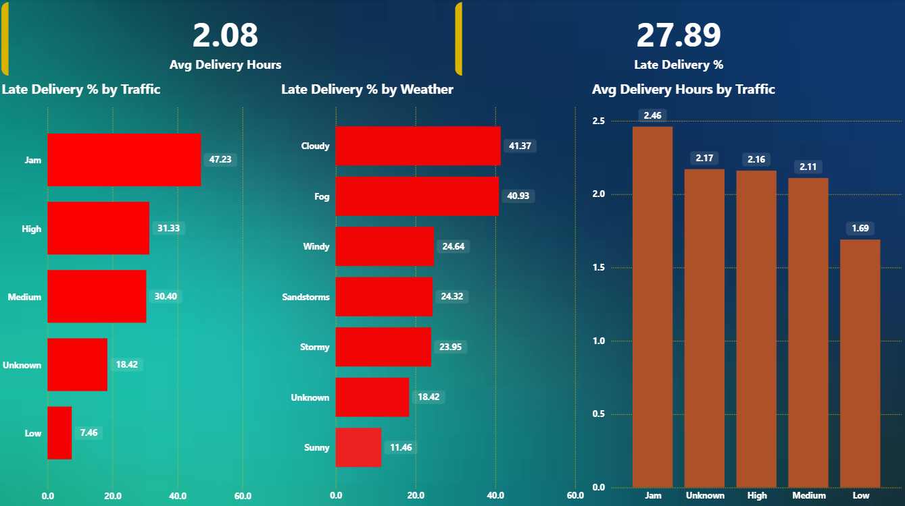

# Amazon Delivery Operations Analytics

## Project Overview
This project analyzes last-mile delivery operations to identify factors driving late deliveries and high delivery time. The goal is to support operational teams with data-driven insights to improve SLA compliance and delivery efficiency.

## Tools Used
- Python (Pandas, NumPy)
- PostgreSQL
- Power BI

## Dataset
Amazon Delivery Dataset (Kaggle)

## Business Questions
- What is the overall late delivery rate?
- Which areas have the highest late deliveries?
- How do traffic and weather affect delivery time?
- Which vehicle types perform best?
- Does agent rating impact delivery performance?

## Data Pipeline
Raw CSV → Python Cleaning & Feature Engineering → PostgreSQL → Power BI Dashboard

## Dashboard Preview

### Executive Overview

### Delay Drivers

### Operations Performance

## Key Insights
- Late delivery rate is 27.89%.
- Semi-urban areas have the highest late deliveries.
- Jam traffic and cloudy/foggy weather significantly increase delays.
- Bicycle and scooter deliveries perform better than motorcycles.
- Higher-rated agents have fewer late deliveries.

## Deliverables
- Cleaned dataset
- SQL analytical queries
- Power BI dashboard
- Business summary report

## Author
Prajwal Sonekar
